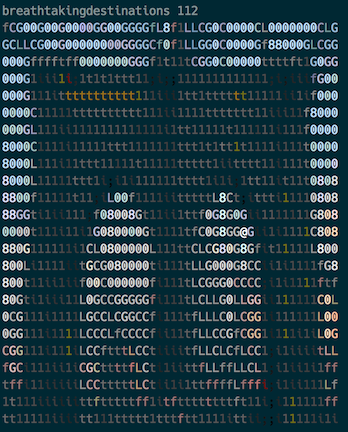

# turmblinal
Tumblr client for the terminal
## About
An idea @grahamvo and I joked about and decided to throw together. This is a simple project that will allow you to view your tumblr dashboard in the terminal. The images are converted into ASCII and given color. Uses node.js to display the dashboard.

First the user who posted the images name will be displayed followed by the amount of notes on the picture. The image will be displayed below the text (example below).

## How to use
* Clone this repository and run `npm install` to install the necessary files including *babel*.
  * I'm assuming you have node.js installed already, if not then run `brew install node`. This also relies on the assumption you have brew installed. If not then I highly suggest this package manager, head over to http://brew.sh and download.
* In the `config` folder open the `default.yml` and input your tumblr authentication details. Don't have a consumer key or token? Keep reading..

## Getting the consumer key and token to use the app
Head on over to https://www.tumblr.com/oauth/apps and click **Register Application**, input a name and any other information and click **Register** near the bottom. On the next screen you will be shown the new application with some options. Click **Explore API** and you should be taken to the console. All you will need to do is click **Javescript** and copy over all the information. You will need the `consumer_key`, `consumer_secret`, `token`, and `token_secret`. Once you put all these into the `default.yml` file (no quotes around the keys) then you're ready to go!

## Fire it up!
To run turmblinal just type `node turmblinal.js` and magic will happen!
